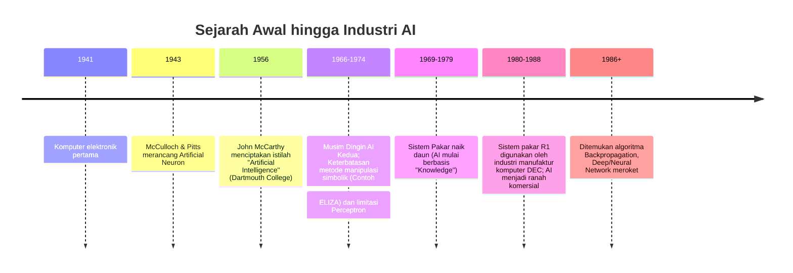

---
title:
  - Konsep Kecerdasan Buatan
type: Lecture
course:
  - Artificial Intelligence
topic:
  - Konsep Kecerdasan Buatan
semester: 4
tags:
  - artificial-intelligence
  - college
  - lecture-note
status: 🌳 evergreen
created: 2026-03-10
week: 1
---

## Daftar Isi

1. [[#Definisi Kecerdasan Buatan]]
2. [[#Empat Pendekatan Definisi AI]]
3. [[#Kesimpulan Definisi AI]]
4. [[#Komponen dalam AI]]
5. [[#Aplikasi-Aplikasi AI]]
6. [[#Sejarah Perkembangan AI]]
7. [[#AI Saat Ini]]
8. [[#AI Masa Depan dan Prediksi]]

---

## Definisi Kecerdasan Buatan

Kecerdasan Buatan (Artificial Intelligence / AI) bukanlah konsep tunggal dengan satu definisi yang disepakati secara universal. Sebaliknya, para ilmuwan dan filsuf mendefinisikannya dari empat sudut pandang yang berbeda, yang tersusun dalam dua dimensi:

- **Dimensi pertama:** apakah sistem meniru _manusia_ ataukah bertindak _rasional_ (optimal secara logika).
- **Dimensi kedua:** apakah yang ditiru adalah _proses berpikir_ (pikiran/internal) ataukah _perilaku nyata_ (tindakan/eksternal).

Perpaduan dua dimensi ini menghasilkan empat definisi:

| | **Berfokus pada Manusia** | **Berfokus pada Rasionalitas** |
| :--- | :--- | :--- |
| **Proses Berpikir (Internal)** | **Thinking Humanly** _(Cognitive Science, Neuroscience)_ | **Thinking Rationally** _(Silogisme, Penalaran Logis)_ |
| **Tindakan Nyata (Eksternal)** | **Acting Humanly** _(Turing Test, NLP, Computer Vision)_ | **Acting Rationally** _(Rational Agent, Memaksimalkan Tujuan)_ |

Memahami perbedaan keempat definisi ini penting karena masing-masing membawa implikasi yang berbeda pada cara kita merancang dan mengevaluasi sistem AI.

---

## Empat Pendekatan Definisi AI

### 1. Acting Humanly — Bertindak Seperti Manusia

> [!info] Definisi
> Pendekatan ini mendefinisikan AI sebagai **sistem komputer yang dirancang untuk bertindak seperti manusia**, sedemikian rupa sehingga perilakunya tidak dapat dibedakan dari perilaku manusia dalam situasi tertentu. Fokusnya bukan pada cara kerja internal sistem, melainkan pada apakah _hasil_ tindakannya terlihat seperti tindakan manusia.

#### [[Turing Test]] — Tolak Ukur Klasik

Pada tahun 1950, matematikawan dan ilmuwan komputer bernama **Alan Turing** merancang sebuah metode pengujian yang kini dikenal sebagai **Turing Test** (Uji Turing). 

Mekanisme Turing Test bekerja sebagai berikut:
- Seorang **interrogator** (penanya manusia) berkomunikasi melalui teks.
- Di sisi lain ada dua pihak: satu manusia dan satu komputer — keduanya merespons pertanyaan si penanya secara teks.
- Jika **interrogator tidak dapat membedakan** mana yang manusia dan mana yang komputer, maka komputer tersebut dinyatakan telah lulus Turing Test.

> [!tip] Konteks Modern
> Turing Test yang dulunya merupakan eksperimen teoritis kini sangat relevan dalam kehidupan sehari-hari, seperti saat kita berinteraksi dengan AI generatif seperti **ChatGPT** atau bot customer service, di mana seringkali sulit membedakan apakah kita sedang berbicara dengan manusia atau mesin.

#### Kemampuan yang Dibutuhkan untuk Lulus Turing Test

Agar komputer mampu menipu seorang interrogator manusia, ia harus memiliki setidaknya enam kemampuan inti:

1. **[[Natural Language Processing]] (NLP)** — kemampuan memahami dan menghasilkan bahasa manusia (misalnya Bahasa Indonesia atau Inggris).
2. **[[Knowledge Representation]]** — kemampuan menyimpan dan mengorganisir pengetahuan tentang dunia secara terstruktur.
3. **Automated Reasoning** — kemampuan menggunakan pengetahuan yang tersimpan untuk menarik kesimpulan.
4. **[[Machine Learning]]** — kemampuan belajar dari pengalaman dan data, sehingga sistem beradaptasi pada situasi baru *(Contoh Modern: Algoritma rekomendasi TikTok, YouTube)*.
5. **[[Computer Vision]]** — kemampuan memahami dan menginterpretasikan gambar atau video *(Contoh Modern: FaceID di smartphone, Tesla Autopilot)*.
6. **Robotics** — kemampuan berinteraksi secara fisik dengan dunia nyata.

---

### 2. Thinking Humanly — Berpikir Seperti Manusia

> [!info] Definisi
> Berbeda dari Acting Humanly yang fokus pada perilaku luar, **Thinking Humanly** berfokus pada **proses kognitif internal**. Pendekatan ini mendefinisikan AI sebagai sistem yang meniru cara manusia belajar, bernalar, mengingat, dan mengambil keputusan.

#### Fondasi Ilmiah
Pendekatan ini sangat dipengaruhi oleh tiga bidang ilmu:
- **Psikologi Kognitif** — mempelajari proses mental manusia.
- **Ilmu Saraf (Neuroscience)** — mempelajari struktur dan fungsi otak serta saraf.
- **Ilmu Kognitif (Cognitive Science)** — menggabungkan psikologi, neurosains, linguistik, filsafat, dan ilmu komputer.

> [!warning] Masalah Filosofis
> Sangat sulit untuk membuat model yang akurat tentang proses berpikir manusia karena **kita tidak bisa sepenuhnya mengamati proses berpikir kita sendiri dari dalam**; begitu kita mencoba mengamatinya, kita sudah mengubahnya. Akibatnya, definisi ini dianggap kurang praktis sebagai dasar pengembangan AI saat ini.

---

### 3. Thinking Rationally — Berpikir Secara Rasional

> [!info] Definisi
> **Thinking Rationally** mendefinisikan AI sebagai sistem yang merepresentasikan pengetahuan dan melakukan penalaran secara logis untuk menghasilkan kesimpulan yang benar, berdasarkan aturan-aturan formal. 

AI berbasis Thinking Rationally berakar pada silogisme logika kuno (misal: "Semua manusia fana. Socrates adalah manusia. Maka Socrates fana.")

#### Tantangan Utama Pendekatan Ini

1. **Formalisasi Pengetahuan Informal:** Mengubah pengetahuan sehari-hari yang ambigu menjadi notasi logika formal sangat sulit, terutama dengan ketidakpastian. (Lihat: [[Fuzzy Logic]])
2. **Kesenjangan antara Teori dan Dunia Nyata:** Secara teoritis logis, tetapi di dunia nyata jumlah kemungkinan terlalu besar (_combinatorial explosion_) dan tidak praktis secara komputasional.

---

### 4. Acting Rationally — Bertindak Secara Rasional

> [!important] Definisi Utama: Rational Agent
> Ini adalah definisi yang **paling tepat dan paling banyak diterima** dalam dunia AI saat ini. Pendekatan ini mendefinisikan AI sebagai sistem yang bertindak sebagai [[Rational Agent]]. Agen rasional mengevaluasi lingkungannya melalui sensor, memproses informasi, dan memilih tindakan yang **memaksimalkan pencapaian tujuannya**.

#### Mengapa Acting Rationally Lebih Unggul?
- Lebih **fleksibel** dari Acting Humanly: tidak terbatas meniru cara manusia.
- Lebih **praktis** dari Thinking Humanly: tidak perlu meniru proses kognitif biologis yang rumit.
- Lebih **luas** dari Thinking Rationally: mencakup aksi dan penalaran dalam ketidakpastian serta darurat.

### 🧠 Active Recall (Uji Pemahaman)

Mengapa pendekatan "Acting Rationally" dianggap sebagai definisi AI paling relevan saat ini dibandingkan "Acting Humanly"?

Karena <i>Acting Rationally</i> memungkinkan sistem ([[Rational Agent]]) untuk mencapai tujuan dengan cara yang paling optimal dan efisien, tanpa dibatasi oleh keharusan meniru keterbatasan atau ketidakrasionalan cara manusia bertindak.

---

## Kesimpulan Definisi AI

> [!summary] Kesimpulan Utama
> **AI = sistem yang _acting rationally_ sebagai _rational agent_.**

Penjelasannya: 
- Pemikiran manusia yang memiliki refleks dan intuisi di luar nalar rasional membuat _Acting/Thinking Humanly_ sulit ditiru secara sempurna oleh AI.
- _Thinking Rationally_ terlalu sempit karena hanya berfokus pada logika ideal di dalam sistem, mengabaikan tindakan eksternal.
- Jadi, komputer AI dituntut melakukan penalaran masuk akal (logis), sekaligus mengeksekusi _aksi nyata_ yang paling memaksimalkan peluang berhasil. 

---

## Komponen dalam AI

AI bukanlah teknologi tunggal. Berikut adalah sub-komponen utama:

### [[Sistem Pakar (Expert System)]]
Program konsultasi yang menirukan proses penalaran seorang pakar/ahli dalam memecahkan masalah. Sering dipakai dalam medis (diagnosis penyakit) atau diagnosis kerusakan mesin.

### [[Natural Language Processing]] (NLP)
Memungkinkan pengguna berkomunikasi dengan komputer dalam bahasa alami (Inggris, Indonesia, dll.). Contoh modern: ChatGPT, Google Translate.

### Speech/Voice Understanding
Teknik mengkonversi sinyal suara manusia yang diucapkan menjadi makna/teks. Contoh modern: Siri, Google Assistant.

### Sistem Sensor dan Robotika
Robot dengan sensor (kamera, mikrofon, jarak) untuk merespons dan beradaptasi terhadap lingkungan secara adaptif.

### [[Computer Vision]]
Menerjemahkan informasi visual dari foto/video (Pencitraan $\rightarrow$ Pengolahan citra $\rightarrow$ Pengenalan pola $\rightarrow$ Pengambilan keputusan). Contoh modern: Deteksi cacat pabrik, Face Pay, Tesla Vision.

### [[Machine Learning]]
> [!info] Mesin Belajar
> Cabang AI yang melatih komputer untuk belajar dan memecahkan masalah **dari data pola masa lalu**, bukan dari aturan pemrograman eksplisit.

### 🧠 Active Recall (Uji Pemahaman)

Apa perbedaan mendasar antara Sistem Pakar dan Machine Learning?

[[Sistem Pakar (Expert System)]] bergantung pada kumpulan <i>aturan eksplisit</i> (rule-based) dari seorang manusia ahli (misal jika A maka B), sedangkan [[Machine Learning]] belajar menebak aturan atau membuat klasifikasi secara otomatis dengan menelan dan mencari pola dari <i>data besar (dataset)</i> masa lalu.

---

## Aplikasi-Aplikasi AI

- **Computer Vision:** ALVINN (navigasi mandiri jadul), inspeksi X-Ray bagasi, hingga konversi 2D ke 3D.
- **Speech Processing:** _Text to Speech_ (TTS), _Speech to Text_ (STT), dan _Speech to Speech Machine Translation_ (S2SMT) untuk penerjemahan telepon _real-time_.
- **Game & Kecerdasan Buatan:** 
  - **Deep Blue:** AI catur IBM berbasis penalaran logika yang mengalahkan Garry Kasparov pada 1997.
  - **Neurogammon / AlphaGo**: AI permainan berbasis pembelajaran dari data (Deep Learning/Reinforcement Learning).
- **Spam Filtering:** Menggunakan AI untuk mengklasifikasi _email_ sebagai spam (penipuan, phising, promosi ilegal) atau masuk _inbox_ utama.
- **Diagnosis Medis:** Deteksi retinopati melalui citra retina. Sering dibantu dengan **Explainable AI (XAI)** (seperti Grad-CAM atau SHAP) agar hasil tebakan hitam-putih kotak AI dapat dijelaskan secara transparan kepada dokter "mengapa" mengambil kesimpulan tersebut.
- **Deteksi Anomali Jaringan:** Intrusion Detection System (IDS) di mana Machine Learning membantu memeriksa lalu lintas internet untuk mendeteksi _hacker_ atau anomali jaringan.

---

## Sejarah Perkembangan AI

> [!important] Bapak Kecerdasan Buatan
> **John McCarthy** dikenal sebagai "Father of AI" setelah mencetuskan istilah "Artificial Intelligence" di konferensi Dartmouth College pada tahun 1956.

---

## AI Saat Ini

Bidang AI berkembang luas dan bisa menjadi spesifik ke area berikut:
- **Global Optimization:** Menemukan solusi terbaik dari ruang pencarian masif.
- **Expert Systems:** Pendekatan AI klasik (Logika Formal Simbolis).
- **Evolutionary Computation:** (Misal: Genetic Algorithm) Belajar dan mencari solusi berdasar seleksi alam buatan.
- **Soft Computing:** Pendekatan yang lebih adaptif pada ketidakktepatan (non-biner), misal [[Fuzzy Logic]] dan [[Neural Network]].

---

## AI Masa Depan dan Prediksi

### Prediksi Evolusi AI (Ray Kurzweil, 1999) 
Ray Kurzweil, ilmuwan komputer futurist, memprediksi laju perkembangan AI (yang didominasi _technological singularity_). Beberapa prediksi telah menjadi kenyataan saat ini:
- **2009:** _Translating telephone_ dan _wearable_ komputer mengecil (Tercapai: Smartwatch).
- **2019:** VR tiga dimensi massif, interaksi gesture/bahasa alami dua arah (Tercapai: Siri, Google Assistant, Meta Quest).
- **2029:** Pencangkokan otak (Neuralink dalam pengembangan masa kini), 1 PC berkekuatan 1000 otak manusia.
- **2099:** Batas yang kabur antara pemikiran sadar manusia asli dengan kecerdasan simulasi mesin.

> [!CAUTION] Pertanyaan Filosofis tentang Masa Depan AGI
> Akankah _Artificial General Intelligence_ (AI yang setara/mendekati kemampuan manusia seutuhnya) kelak mampu merancang AI baru yang *lebih* cerdas dan berulang *(intelligence explosion)*? Apakah kita lebih cerdas dari proses yang menciptakan kita?

---

## Daftar Pustaka

- Suyanto. 2007. _Artificial Intelligence: Searching, Reasoning, Planning and Learning_. Informatika, Bandung Indonesia. ISBN: 979-1153-05-1.
- Russel, Stuart and Norvig, Peter. 1995. _Artificial Intelligence: A Modern Approach_. Prentice Hall International, Inc.

---
_Catatan direvisi secara otomatis dengan gaya Zettelkasten modern, referensi visual, dan callout interaktif._