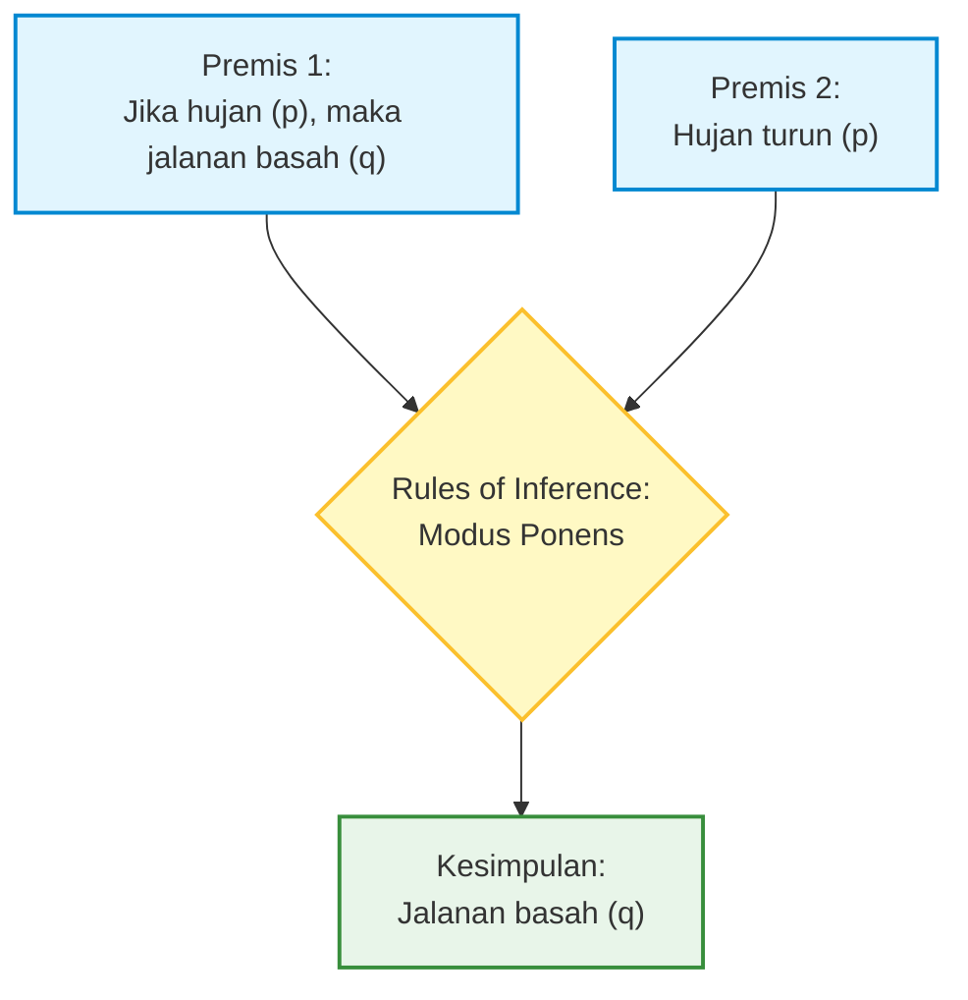
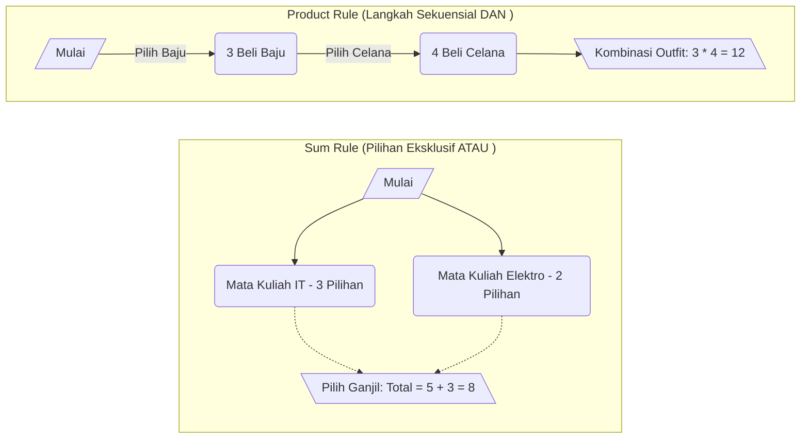

---
title:
  - Logika dan Pencacahan
type: Lecture
course:
  - Discrete Mathematics I
topic:
  - Mathematical Logic
  - Counting Basics
semester: 4
tags:
  - discrete-mathematics
  - logic
  - counting
  - college
  - lecture-note
created: 2026-03-11
---

# Logika dan Pencacahan

**Reference:** Rosen, K.H. *Discrete Mathematics and Its Applications*; Munir, R. *Matematika Diskrit dan Aplikasinya pada Ilmu Komputer*
**Source:** [[RPS-MD1]]

---

## Daftar Isi

1. [[#1. Apa itu Matematika Diskrit?]]
2. [[#2. Proposisi dan Logika Proposisional]]
    - [[#2.1 Definisi Proposisi]]
    - [[#2.2 Operator Logika (Logical Connectives)]]
    - [[#2.3 Tabel Kebenaran (Truth Tables)]]
    - [[#2.4 Ekuivalensi Logis (Logical Equivalences)]]
3. [[#3. Logika Predikat (Predicate Logic)]]
    - [[#3.1 Dari Proposisi ke Predikat]]
    - [[#3.2 Quantifiers — Kuantor Universal dan Eksistensial]]
4. [[#4. Rules of Inference — Aturan Penarikan Kesimpulan]]
    - [[#4.1 Mengapa Rules of Inference Penting?]]
    - [[#4.2 Aturan-aturan Dasar Inferensi]]
    - [[#4.3 Fallacy — Kesalahan Penalaran]]
5. [[#5. Paradoks dalam Logika]]
    - [[#5.1 Paradoks Klasik]]
    - [[#5.2 Konteks Informatika Mengapa Paradoks Penting?]]
6. [[#6. Pengantar Pencacahan (Introduction to Counting)]]
    - [[#6.1 The Sum Rule (Aturan Penjumlahan)]]
    - [[#6.2 The Product Rule (Aturan Perkalian)]]
    - [[#6.3 Menggabungkan Sum Rule dan Product Rule]]
7. [[#Summary — Key Concepts at a Glance]]
8. [[#Active Recall Questions]]

---

## 1. Apa itu Matematika Diskrit?

Matematika diskrit adalah cabang matematika yang mempelajari objek-objek **diskrit** — yaitu objek yang bisa dihitung satu per satu, berbeda dari objek **kontinu** yang mengalir tanpa batas di antara dua nilai.

> [!info] Analogi: Tangga vs. Ramp
> Bayangkan sebuah tangga versus *ramp* (bidang miring). Jika kamu menaiki tangga, kamu berada di anak tangga ke-1, ke-2, ke-3 — tidak ada "anak tangga ke-1,5". Itulah **diskrit**. Jika kamu berjalan naik di sebuah *ramp*, kamu bisa berada di ketinggian *mana pun* — 1,0 meter, 1,0001 meter, 1,00015 meter. Itulah **kontinu**.

Dalam ilmu komputer, hampir semua yang kita kerjakan bersifat diskrit. Komputer bekerja dengan **bit** — 0 dan 1 — bukan bilangan yang mengalir kontinu. Algoritma bekerja dalam **langkah-langkah** yang bisa dihitung. Data disimpan dalam **byte** yang berhingga. Oleh karena itu, matematika diskrit menjadi fondasi paling penting bagi informatika.

Mata kuliah Matematika Diskrit I membahas logika, [[Himpunan]], pembuktian, induksi, prinsip pencacahan, [[Fungsi]], relasi, dan relasi rekursi — semua ini adalah alat-alat dasar yang akan digunakan di hampir setiap mata kuliah informatika lanjutan.

---

## 2. Proposisi dan Logika Proposisional

### 2.1 Definisi Proposisi

> [!abstract] Definisi: Proposisi
> Sebuah **[[Proposisi]]** (proposition) adalah pernyataan deklaratif yang bernilai **benar (True)** atau **salah (False)** — tidak pernah keduanya, dan tidak pernah "tidak tentu". Ini disebut **prinsip bivalen** (principle of bivalence).

> [!example] Contoh Proposisi dan Bukan Proposisi
> **Proposisi:**
> - "2 + 3 = 5" $\rightarrow$ **True**
> - "Jakarta adalah ibu kota Thailand" $\rightarrow$ **False**
> - "Setiap bilangan genap lebih besar dari 2 adalah jumlah dua bilangan prima" (Konjektur Goldbach) $\rightarrow$ Belum dibuktikan benar atau salah secara final, tapi secara prinsip harus bernilai benar atau salah.
> 
> **Bukan Proposisi:**
> - "Tutup pintu!" $\rightarrow$ Ini perintah.
> - "Berapa umurmu?" $\rightarrow$ Ini pertanyaan.
> - "x + 1 = 2" $\rightarrow$ Bukan proposisi *sampai* kita tahu nilai x. Ini disebut **[[Fungsi Proposisional]]**, yang dibahas dalam [[Logika Predikat]].

Proposisi biasanya dilambangkan dengan huruf kecil: $p$, $q$, $r$, dsb.

### 2.2 Operator Logika (Logical Connectives)

Proposisi-proposisi sederhana dapat digabungkan menggunakan **[[Operator Logika]]** untuk membentuk proposisi yang lebih kompleks. 

| Operator | Nama | Simbol | Dibaca |
|---|---|---|---|
| Negasi | NOT | $\lnot p$ | "bukan p" / "not p" |
| Konjungsi | AND | $p \land q$ | "p dan q" |
| Disjungsi | OR | $p \lor q$ | "p atau q" (inklusif) |
| Disjungsi Eksklusif | XOR | $p \oplus q$ | "p atau q, tapi tidak keduanya" |
| Implikasi | IF...THEN | $p \rightarrow q$ | "jika p maka q" |
| Biimplikasi | IF AND ONLY IF | $p \leftrightarrow q$ | "p jika dan hanya jika q" |

> [!note] Konteks Informatika: Operator Bitwise dan Logika
> Dalam pemrograman (seperti Java, C++, Python), operator logika dikaitkan erat dengan operasi boolean dan bitwise:
> - **NOT**: Logika `!p` $\rightarrow$ Bitwise `~p`
> - **AND**: Logika `p && q` $\rightarrow$ Bitwise `p & q`
> - **OR**: Logika `p || q` $\rightarrow$ Bitwise `p | q`
> - **XOR**: Bitwise `p ^ q`

> [!warning] Hati-hati: Vacuous Truth dalam Implikasi
> **Implikasi** ($p \rightarrow q$) sering membingungkan. $p$ disebut **hipotesis** dan $q$ disebut **kesimpulan**.
> Secara kontra-intuitif: **jika $p$ salah, maka $p \rightarrow q$ selalu bernilai benar**, apapun nilai $q$. Ini disebut **Vacuous Truth** (Kebenaran Kosong)—sebuah janji yang tidak dilanggar karena kondisinya tidak pernah terpenuhi.
> *Analogi:* "Jika hujan, saya bawa payung." Jika hari ini *tidak* hujan, kamu tidak bisa menilai saya melanggar janji—janji itu otomatis "terpenuhi" karena kondisinya tidak terjadi.

### 2.3 Tabel Kebenaran (Truth Tables)

**Tabel Kebenaran** (Truth table) adalah alat untuk secara sistematis mengevaluasi kemungkinan nilai kebenaran. Untuk $n$ variabel proposisi, tabel kebenaran memiliki $2^n$ baris (pertumbuhan **eksponensial**).

**Contoh:** Tabel kebenaran untuk implikasi $p \rightarrow q$:

| $p$ | $q$ | $p \rightarrow q$ |
|---|---|---|
| T | T | T |
| T | F | F |
| F | T | T |
| F | F | T |

Perhatikan baris ketiga dan keempat — ketika $p$ bernilai False, implikasi selalu bernilai True.

### 2.4 Ekuivalensi Logis (Logical Equivalences)

Dua proposisi disebut **[[Ekuivalensi Logis|Logically Equivalent]]** jika mereka memiliki nilai kebenaran yang sama untuk *setiap* kombinasi nilai kebenaran variabel penyusunnya. Ditulis: $p \equiv q$.

> [!abstract] [[Hukum De Morgan]]
> $$\lnot(p \land q) \equiv (\lnot p) \lor (\lnot q)$$
> $$\lnot(p \lor q) \equiv (\lnot p) \land (\lnot q)$$
> 
> *Analogi:* "Bukan benar bahwa kamu pintar **dan** rajin" $\equiv$ "Kamu tidak pintar **atau** kamu tidak rajin." Negasi mengubah AND menjadi OR, dan sebaliknya.

> [!example] Konteks Pemrograman: De Morgan
> Sangat berguna untuk menyederhanakan *control flow* (percabangan `if` atau `while`). Terkadang kita mengecek kebalikan dari suatu pengecekan rentang nilai:
> Kondisi `if (!(x > 5 && y == 0))` bisa disempurnakan menjadi `if (x <= 5 || y != 0)`.

**Hukum-hukum lain yang penting:**

| Nama Hukum | Ekuivalensi |
|---|---|
| Hukum Identitas | $p \land T \equiv p$ ; $p \lor F \equiv p$ |
| Hukum Dominasi | $p \lor T \equiv T$ ; $p \land F \equiv F$ |
| Hukum Idempoten | $p \land p \equiv p$ ; $p \lor p \equiv p$ |
| Hukum Negasi Ganda | $\lnot(\lnot p) \equiv p$ |
| Hukum Komutatif | $p \land q \equiv q \land p$ ; $p \lor q \equiv q \lor p$ |
| Hukum Asosiatif | $(p \land q) \land r \equiv p \land (q \land r)$ |
| Hukum Distributif | $p \land (q \lor r) \equiv (p \land q) \lor (p \land r)$ |
| Hukum Kontrapositif | $p \rightarrow q \equiv \lnot q \rightarrow \lnot p$ |

**Kontrapositif** sangat berguna dalam pembuktian formal. Daripada membuktikan "jika p maka q" secara langsung, kadang lebih mudah membuktikan "jika bukan q maka bukan p" karena keduanya ekuivalen.

---

## 3. Logika Predikat (Predicate Logic)

### 3.1 Dari Proposisi ke Predikat

Logika proposisional memiliki keterbatasan mutlak: ia tidak bisa mengekspresikan pernyataan tentang **variabel**. Pernyataan "x > 3" tidak dapat dinyatakan nilai kebenarannya sampai $x$ diuraikan. Sejak sinilah **[[Logika Predikat]]** menjadi fundamental.

> [!abstract] Definisi: Predikat
> Sebuah **predikat** adalah pernyataan yang mengandung satu atau lebih variabel. Notasi: $P(x)$ berarti "pernyataan $P$ tentang $x$".
> Predikat berubah menjadi sebuah proposisi sejati selagi variabelnya diberikan nilai tertentu, atau variabelnya diikat oleh sebuah **[[Kuantor]]**.

> [!example] Evaluasi Predikat
> - $P(x)$: "$x$ adalah bilangan prima"
> - $P(7)$: "7 adalah bilangan prima" $\rightarrow$ **True** (menjadi proposisi riil)
> - $P(4)$: "4 adalah bilangan prima" $\rightarrow$ **False**

### 3.2 Quantifiers — Kuantor Universal dan Eksistensial

**[[Kuantor]]** berfungsi "mengikat" variabel dalam predikat, sehingga menjadi proposisi utuh tanpa ambiguitas nilai.

> [!abstract] Kuantor Universal ($\forall$) — "Untuk semua"
> $$\forall x \, P(x)$$
> Artinya: "$P(x)$ benar untuk **setiap** nilai $x$ dalam domain yang ditentukan."
> *Contoh:* $\forall x \in \mathbb{Z}^+, \, x + 1 > x$. Untuk menyangkal hal ini, kamu hanya butuh satu **counterexample** (contoh penyangkal).

> [!abstract] Kuantor Eksistensial ($\exists$) — "Ada / Setidaknya satu"
> $$\exists x \, P(x)$$
> Artinya: "Terdapat **setidaknya satu** nilai $x$ dalam domain sehingga $P(x)$ benar."
> *Contoh:* $\exists x \in \mathbb{R}, \, x^2 = 2$ bernilai sejati, karena $x = \sqrt{2}$.

> [!warning] Merotasi Negasi Kuantor
> Negasi kuantor sangat krusial dalam pembuktian tidak langsung:
> - $\lnot(\forall x \, P(x)) \equiv \exists x \, \lnot P(x)$
> - $\lnot(\exists x \, P(x)) \equiv \forall x \, \lnot P(x)$
> 
> *Analogi:* "Tidak benar bahwa **semua** mahasiswa lulus ujian" $\equiv$ "**Ada** setidaknya satu mahasiswa yang tidak lulus ujian."

---

## 4. Rules of Inference — Aturan Penarikan Kesimpulan

### 4.1 Mengapa Rules of Inference Penting?

Setiap argumen deduktif logis di desain dari blok-blok kecil, dan blok-blok tersebut disebut **[[Rules of Inference]]**.

> [!abstract] Inti Rules of Inference
> Jika logika proposisional menyediakan *bahasanya*, maka aturan referensi menyediakan *tata bahasa* strukturalnya - memastikan transisinya dari satu premis ke kesimpulan secara valid.

### 4.2 Aturan-aturan Dasar Inferensi

| Aturan | Bentuk Formal | Penjelasan |
|---|---|---|
| **[[Modus Ponens]]** | $p, \, p \rightarrow q \, \therefore q$ | Jika $p$ benar dan ($p \rightarrow q$) benar, maka $q$ berlaku. |
| **[[Modus Tollens]]** | $\lnot q, \, p \rightarrow q \, \therefore \lnot p$ | Bekerja mundur dengan penyangkalan implikasi logis. |
| **Hypothetical Syllogism** | $p \rightarrow q, \, q \rightarrow r \, \therefore p \rightarrow r$ | Rantai implikatif ("domino logic"). |
| **Disjunctive Syllogism** | $p \lor q, \, \lnot p \, \therefore q$ | Alternatif mutakhir jika kondisi dominan pertama salah. |
| **Addition** | $p \, \therefore p \lor q$ | Boleh memperluas status benar dengan kondisi `OR`. |
| **Simplification** | $p \land q \, \therefore p$ | Menarik konformitas partikel dari kondisi `AND`. |
| **Conjunction** | $p, \, q \, \therefore p \land q$ | Merestrukturisasi 2 independen T menjadi konektif valid. |
| **Resolution** | $p \lor q, \, \lnot p \lor r \, \therefore q \lor r$ | Sangat penting dalam *Automated Theorem Proving* dan algoritma AI masa kini. |

> [!example] Modus Ponens di Kehidupan Nyata
> - **Premis 1:** "Jika program error, ada bug di kode." ($p \rightarrow q$)
> - **Premis 2:** "Program error waktu dieksekusi." ($p$)
> - **Kesimpulan:** "Ada bug di kode." ($q$) ✅

### 4.3 Fallacy — Kesalahan Penalaran

Sebuah **[[Logical Fallacy|Fallacy]]** (kekeliruan logis) terjadi ketika alur deduksi *terlihat* valid padahal melanggar struktur inferensi matematis.

> [!warning] Dua Fallacy Paling Umum dan Mematikan
> 
> 1. **Affirming the Consequent (Mengafirmasi Konsekuen)** ❌
>    - Struktur: $p \rightarrow q, \, q \, \therefore p$
>    - *Contoh:* "Jika hujan, jalanan basah. Jalanan basah. Maka pasti hujan." (Fatal: Jalanan bisa basah karena disiram air keran, bukan hujan).
> 
> 2. **Denying the Antecedent (Menyangkal Anteseden)** ❌
>    - Struktur: $p \rightarrow q, \, \lnot p \, \therefore \lnot q$
>    - *Contoh:* "Jika hujan, jalanan basah. Tidak hujan. Maka jalanan tidak basah." (Fatal: Jalanan bisa saja tersetok basah oleh pipa bocor padahal baru saja tidak hujan).

---

## 5. Paradoks dalam Logika

> [!abstract] Definisi: Paradoks
> Rangkaian pernyataan argumentatif yang akan selalu melahirkan kontradiksi pada validitas nilainya sendiri (tidak bisa bernilai sebatas *True* atau *False* secara konvensional).

### 5.1 Paradoks Klasik

> [!example] Paradoks Tukang Cukur (Barber Paradox)
> "Di sebuah desa pedalaman, ada tukang cukur yang akan mencukur semua orang yang *tidak* mencukur dirinya sendiri. Siapa yang mencukur si tukang cukur?"
> - Jika ia cukur sendiri $\rightarrow$ menyalahi aturan karena ia cuma mencukur yang tidak mencukur sendiri.
> - Jika ia tidak cukur sendiri $\rightarrow$ aturan mengharuskan ia (tukang cukur) cukur dirinya. 

> [!example] Paradoks Pembohong (Liar Paradox)
> *"Kalimat ini sepenuhnya salah."*
> - Jika pernyataan benar $\rightarrow$ Klaimnya benar bahwa kalimat itu salah $\rightarrow$ Kontradiksi.

### 5.2 Konteks Informatika: Mengapa Paradoks Penting?

Dalam teori graf, desain *database*, dan teori komputabilitas, paradoks melatih batasan desain sistem.
- **Halting Problem:** Alan Turing membuktikan tidak ada algoritma umum yang memutus program tersebut berhenti / tak terbatas berbasis paradoks ini.
- **Self-reference:** Mengindikasikan celah dalam struktur rekursi yang dapat bertransformasi sebagai memori tak lekat / Stack Overflow.

---

## 6. Pengantar Pencacahan (Introduction to Counting)

Pencacahan alias permutasi-kombinasi ini menjawab fondasi probabilitas: **"Ada berapa banyak total cara valid?"**

### 6.1 The Sum Rule (Aturan Penjumlahan)

> [!abstract] [[Aturan Penjumlahan]] (The Sum Rule)
> Digunakan saat kamu dihadapkan dengan kemungkinan **saling eksklusif** (memilih hal A menghapus fungsionalitas mendapatkan B secara natural).
> 
> - **Rumus:** $n_1 + n_2 + \cdots + n_k$
> - **Kata Kunci Natural:** "ATAU" (OR)

### 6.2 The Product Rule (Aturan Perkalian)

> [!abstract] [[Aturan Perkalian]] (The Product Rule)
> Digunakan ketika ada sekenario di mana serangkaian **langkah saling berdampingan dan harus diselesaikan secara sekuensial dan berurutan**.
> 
> - **Rumus:** $n_1 \times n_2 \times \cdots \times n_k$
> - **Kata Kunci Natural:** "DAN" (AND)

### 6.3 Menggabungkan Sum Rule dan Product Rule

Banyak skenario dunia nyata menuntut komposisi gabungan ini. 

> [!example] Kasus Gabungan String Biner
> "Berapa banyak *string* biner (0 / 1) dengan panjang **tepat 3** ATAU **tepat 4**?"
> - Syarat 'Panjang 3' (*3 langkah sekuensial*): $2 \times 2 \times 2 = 8$
> - Syarat 'Panjang 4' (*4 langkah sekuensial*): $2 \times 2 \times 2 \times 2 = 16$
> - Karena mereka eksklusif (tidak bisa panjuang 3 sekaligus 4 di terminologi yang sama): $8 + 16 = 24$.

---

## Summary — Key Concepts at a Glance

| Concept | Definition |
|---|---|
| Matematika Diskrit | Cabang matematika dasar pemrograman perihal objek mutlak tanpa pecahan |
| [[Proposisi]] | Pernyataan deklaratif yang definitif benar / salah (True / False) |
| [[Operator Logika]] | Simbol penghubung proposisi operasional ($\lnot, \land, \lor, \rightarrow, \leftrightarrow$) |
| [[Ekuivalensi Logis]] | Ekspresi variabel yang sejatinya melahirkan nilai sama pada rentang skema Truth Table |
| [[Hukum De Morgan]] | $\lnot(p \land q) \equiv (\lnot p) \lor (\lnot q)$ membalik sifat komputasi operasional |
| [[Logika Predikat]] | Pengubahan proposisional statis dinamis dengan variabel diikat konseptual kuantor |
| [[Kuantor]] | $\forall$: "Semua" nilai terpenuhi, $\exists$: "Setidaknya ada satu" nilai memenuhi. |
| [[Rules of Inference]] | Rangkaian pola aksiomatik menuju resolusi argumen valid logik |
| [[Modus Ponens]] | Membuktikan $q$ true berdasarkan premis bahwa $p \rightarrow q$ sejati dan $p$ sejati |
| [[Modus Tollens]] | Modus menolak (Menyangkal Q berarti menyangkal hipotesisnya) |
| [[Logical Fallacy]] | Modus operasional fatal penalaran (menyangkal antiseden / afirmasi konsekuen) |
| [[Aturan Penjumlahan]] | Aturan mutlak agregasi eksklusif / terpisah (Kondisi ATAU) |
| [[Aturan Perkalian]] | Perkalian mutlak *compound possibilities* di jalan yang lurus (Kondisi DAN) |

---

## Active Recall Questions

> [!question]- 1. Bagaimana *De Morgan's Laws* diterapkan dalam simplifikasi instruksi query di database (SQL)?
> Hukum ini sangat masif perannya saat merestrukturisasi status klausal `WHERE`. Misalkan kita punya pengecekan validasi: mencari data yang `NOT (Status = 'Active' AND Role = 'Superadmin')`. Menurut De Morgan, kita bisa mempercepat query parser database membacanya tanpa nested parentheses yang membingungkan dengan merubahnya ke ekuivalensi bentuk: `(Status != 'Active' OR Role != 'Superadmin')`. 

> [!question]- 2. Mungkinkah tabel kebenaran digunakan untuk mengevaluasi 6 variabel logika tanpa simplifikasi? 
> **Sangat tidak efisien dan tidak praktis walau bisa.** Secara matematis tabel kebenarannya akan mengandung pertumbuhan baris eksponensial. $n = 6$ melahirkan $2^6 = 64$ baris! Biasanya, teknik *Karnaugh Map (K-Map)* / aljabar boolean lebih pas di sini.

> [!question]- 3. Bagaimana **Resolution Rule** digunakan fundamentalistis dalam *Automated Theorem Proving* (AI)?
> *Resolution* — ($p \lor q, \, \lnot p \lor r \, \therefore q \lor r$) adalah inti cara mayoritas mesin deduktif (spt: logika bahasa Prolog) beroperasi, karena AI mensistematikkan semua deduksi menjadi *Conjunctive Normal Form (CNF)* agar validasi resolusi inferensi tercapai tanpa menjerat otak manusia dengan baris argumen eksponensial.

> [!question]- 4. Apa yang terjadi jika opsi *Sum Rule* tidak mutualmente eksklusif (ada overlap)?
> Maka kamu dilarang menggunakan Sum Rule mentah. Kamu harus beralih menggunakan pedoman **Prinsip Inklusi-Eksklusi** demi mencegah penghitungan ganda (terjadi *double counting* yang sama di kedua cabang).
