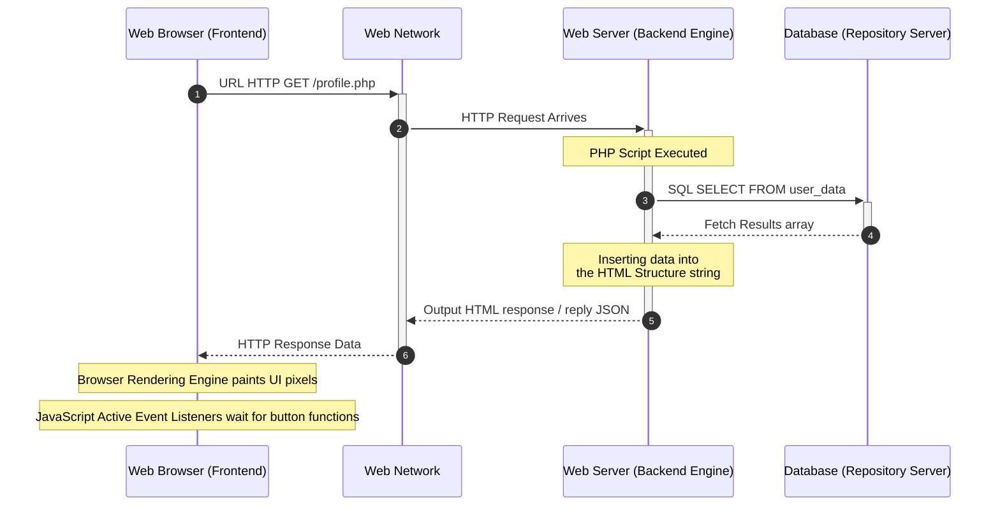

---
title:
  - WP - 1 - Basic Concepts of Web Programming
type: 
  - Lecture
course:
  - Web Programming
topic:
  - Client-Side & Server-Side
semester:
  - 4
tags:
  - Web/Intro
  - Client-Side
  - Server-Side
status: 🌿 incubating
created: 2026-04-13
---

# WP - 1 - Basic Concepts of Web Programming

**Reference:** W3Schools Web Programming Tutorial, RPS-WP.
**Source:** [[RPS-WP]]
**Prerequisite:** -
**Related Practical/Assignment:** IDE Installation (VSCode) and XAMPP (Optional for preparation).

---

## Table of Contents

1. [[#1. Web Architecture Request-Response Cycle]]
2. [[#2. Client-Side Scripting (Frontend)]]
3. [[#3. Server-Side Scripting (Backend)]]
4. [[#4. Client-Side vs Server-Side Workflows]]
5. [[#Summary — Key Concepts at a Glance]]
6. [[#Active Recall Questions]]

---

## 1. Web Architecture & Request-Response Cycle

Web application development (*Web Development*) is based on a network communication architecture called **Client-Server Architecture**. In this model, the device or application requesting data is called a **Client**, and the high-powered central computer providing the data is called a **Server**.

Fundamentally, the main interaction is summarized in the **HTTP Request-Response Cycle**:

1. **Client Action:** The user opens a browser, types a URL (example: google.com), or clicks a submit button.
2. **HTTP Request:** The *Web Browser* constructs an **HTTP Request** and sends it from the client network to the *Web Server*. 
3. **Server Processing:** The *Server* receives the *request*. At this point, *Back-end Scripting* is executed (performing authentication analysis, accessing a SQL *Database*, to orchestrating the final response).
4. **HTTP Response:** The *Server* transmits the final *output* (often in the form of a complete HTML document, or JSON data format) back to the client as a reply object called an **HTTP Response**.
5. **Rendering:** Upon arrival of the compiled *resources* at the client side, the *Browser Native Rendering Engine* will compose the structural skeleton and presentation style (*rendering*) for the user via HTML/CSS formatted code syntax, while JavaScript adds the flexibility of visual system activity.

> [!tip] Recommended Video / Resource
> For fundamental network and interaction visualization, it is recommended to watch video materials from MDN Web Docs or fundamental YouTube series such as: ["How the Internet Works in 5 Minutes" by Aaron](https://www.youtube.com/watch?v=7_LPdttKXPc) for a comprehensive asynchronous understanding.

---

## 2. Client-Side Scripting (Frontend)

**Client-Side Scripting** focuses on the end-user device program ecosystem. All kinds of *user interface* (UI) component frameworks and lightweight interaction logic (*lightweight logic*) executed locally through the *Web Browser* application's memory fall under the *Frontend* umbrella.

There are **Three Fundamental Pillars** of *Client-Side* technology:

1. **HTML (HyperText Markup Language):** The construction of the site's structural skeleton and the meaning of each element content (`tags`).
2. **CSS (Cascading Style Sheets):** The cosmetic language of site aesthetic presentation that governs the layout box placement, thematic skin colors (*skinning*), up to mobile adaptation resolution (*Responsive Design*). 
3. **JavaScript:** The interactivity language for manipulating DOM objects that gives life to the page interface so it can respond to mouse *hovers*, *scroll events*, and instantaneous asynchronous validation actions on screen without a global page refresh.

**Advantages of Extensive Client-Side Approach:**
- **Instantaneous Experience:** Interactive interface responses that are almost instantaneously fractional seconds without the need for intermittent reconnections to the *Server*.
- **Offloading Server Load:** Lightens the workload because it does not need to burden the central server for merely computational logic of staging *pixel rendering*.

**Security Implications:**
- **Transparent Source Code:** Because the source code for HTML, CSS, JavaScript assets must flow (*download*) directly and transparently to the *browser's* inspector menu, **Never** include token credentials (actual *passwords*), secret keys (*secret API keys*), and essential operational algorithm logic in the Client-Side realm.

🔗 **External Resource:** [Mozilla Developer Network (MDN) - Web Mechanics](https://developer.mozilla.org/en-US/docs/Learn/Getting_started_with_the_web/How_the_Web_works)

---

## 3. Server-Side Scripting (Backend)

Conversely, **Server-Side Scripting** is the coding done to facilitate the internal operational system foundation and programs specific to the closed area within a *Private Server*. This ecosystem is the "intelligence brain" of a true modern web architecture. 

Specific functions of the *Backend layer* realm:
- **Dynamic HTML/Content Generation:** Printing various custom HTML *templates* sheet by sheet computationally based on recurrent user data (e.g., User Profile, account *Feeds*, shopping cart History).
- **Database Subsystems Interaction (Storage & Persistence):** The connecting heart of relational or non-relational CRUD (*Create, Read, Update, Delete*) operations with long-term SQL (MySQL, PostgreSQL) memory tracking records.
- **Core Security Controls:** Execution of absolute identity validation authentication, admin-user privilege rights, and algorithmic encryption computation.

**Popular Execution Languages and Environments:**
- **PHP:** A classic Web pioneer. Very commonly found in the *LAMP (Linux, Apache, MySQL, PHP)* architecture stack. (In the RPS material, the focus is on this execution implementation).
- Other *Modern Backend* languages for comparison: **Node.js, Python (Django/Flask), as well as Java/Go.**

> [!important] The Golden Rule of Security Check (Absolute)
> *Frontend* validation provided on the user side (e.g., email format input checking via JavaScript) is solely for the smoothness of the *User Experience*. However, **Server-Side Validation is absolutely necessary for database security resilience.** Client validation is very easily disabled by the client (*Client-Side Tampering*), so the *Web Server* must never inherently trust external input data without repeated testing within its fortress.

---

## 4. Client-Side vs Server-Side Workflows

Practically speaking, distinguishing the separate locations of functional Client and Server communication when retrieving a *Dashboard* system page:

From this sophisticated *Request-Response* diagram, it fundamentally appears where the intersection point of the persistent system logic base (including *Database* storage) is exclusively an internal realm of the Server-Side area, impossible to be independently inspected by an ordinary Web Browser without the intermediary of the HTTP protocol path.

---

## Summary — Key Concepts at a Glance

| Concept | Definition |
|---|---|
| **World Wide Web (WWW)** | A giant cross-network hypertext global information system via the internet medium. |
| **HTTP Request-Response** | The basic text messaging intermediary protocol for circular transaction instruction exchange that occurs when a web interacts to send commands to the web servant (*Server*). |
| **Client-Side (Frontend)** | The coding environment domain for the HTML/CSS/JS system lines that runs in its execution place within the applicant reader instrument (*Web Browser*) directly. |
| **Server-Side (Backend)** | The covert programming environment domain for the *remote engine* logically behind the *Server* fortress as the data brain. |
| **Backend Layer Services** | Invisible services carrying *Business Logic rules*, handling memory storage communication (DBMS), and guarding *Authorization*. |

---

## Active Recall Questions

> [!question]- 1. What is the real difference in the execution location (*environment*) for Client-Side programming languages compared to Server-Side Scripting programs?
> **Answer:** 
> *Client-Side scripting* (like JavaScript inside the DOM element) is compiled and directly executed by the engine on the individual device (*User Machine Browser*), making it *Public/Viewable Code*. While the execution of application logic in *Server-Side* scripting takes place entirely within a central machine (*Virtual Server Environment*) in a closed manner, which returns purely to the client in the form of an *HTML Payload string* / *Raw Data text* without exposing its logic contents (being *Concealed/Private Code*).

> [!question]- 2. You have implemented JavaScript to reject registration forms if the *Password* is less than 8 characters. Does your main server still have to re-evaluate this limit check upon the arrival of the *HTTP Request* on the PHP execution system? Why?
> **Answer:** 
> Yes, the server *must still (ABSOLUTELY)* perform repeated filtering with its validation logic again (*Server-Side Validation*). Checking at the *Frontend/JavaScript* realm in the Web Browser easily gets deactivated or bypassed through the use of passive *Custom HTTP Payload software* like Postman. Client checking focuses heavily on interface responsiveness and a fast-replying good *User Experience*, while the backup server checking tier purely focuses on preventing potential deceptive integration of *Bad/Malicious Data* into the central memory forever.

> [!question]- 3. The three crucial foundations that hold full structural functional control of the client explorer side boundary (*Client-Side Stack*) in the web programming world mutually carry separate roles. Can you summarize what the essence of these three pillars of the *Front-end Framework* are structurally in the body?
> **Answer:** 
> 1) HTML is the skeletal format (*Skeleton Structuring*) for a site system page, 2) CSS encompasses aesthetic design cosmetics to the presentation pattern of packaging its spatial layout styling (*Presentation Stylesheets*), and 3) JavaScript becomes the "nerve of interactivity and logical motion response" regulating the logic of UI functionality actions when components are active and do not refresh the page at all.
