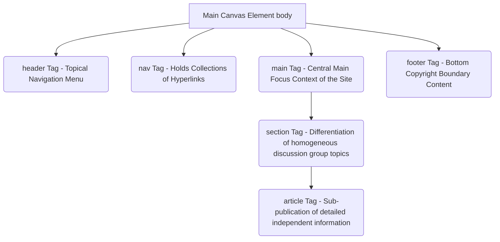
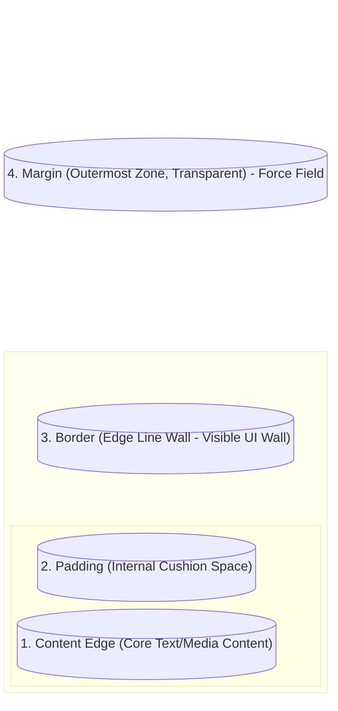

---
title:
  - WP - 2 - HTML and CSS Languages
type: 
  - Lecture
course:
  - Web Programming
topic:
  - HTML & CSS Basics
semester:
  - 4
tags:
  - Web/Frontend
  - HTML
  - CSS
status: 🌿 incubating
created: 2026-04-13
---

# WP - 2 - HTML and CSS Languages

**Reference:** Web Programming with HTML5, CSS, and JavaScript (John Dean, 2019), RPS-WP.
**Source:** [[RPS-WP]]
**Prerequisite:** [[WP - 1 - Basic Concepts of Web Programming]]
**Related Practical/Assignment:** Creating a Static *Layout* (Mini HTML/CSS Programming Exercise).

---

## Table of Contents

1. [[#1. Introduction to HTML (HyperText Markup Language)]]
    - [[#1.1. Basic HTML Document Anatomy]]
    - [[#1.2. HTML5 Semantic Elements]]
2. [[#2. Introduction to CSS (Cascading Style Sheets)]]
    - [[#2.1. Three Paradigms for Incorporating CSS]]
    - [[#2.2. CSS Selectors (Dominant Targeting Syntax)]]
3. [[#3. Essential Concepts of Layouting Systems Controller]]
    - [[#3.1. Fundamental: The CSS Box Model]]
4. [[#Summary — Key Concepts at a Glance]]
5. [[#Active Recall Questions]]

---

## 1. Introduction to HTML (HyperText Markup Language)

**HTML** is an absolute tactical descriptive *Markup Language* lexicon acting as the structural architect of any web application in the IT industry universe. The pure fundamental orientation of HTML tags is merely regulating the functional allocation of the hierarchical organization (which one should be translated into the main hierarchical heading, a sequenced arrangement of long paragraphs, up to representing an image object (*image media tags*)). The purity of HTML's philosophy is outside the territory of "decorative paint color modification".

HTML is represented as a node-by-node hierarchical writing element through element flankers named **Tags** (Angle brackets `<... >`). An ideal tag has a paired form of a beginning `Opening Tag <tagname>` and a closing plug `Closing Tag </tagname>`. Beyond this, there are recognized single independent *Self-closing / Voiceless element* tag exceptions (e.g., the `` element or a `<br>` line break instruction block).

### 1.1. Basic HTML Document Anatomy

When creating a Web page, you need to provide an indispensable foundational skeleton framework that is applicable to the universal *HTML5* engine extension standards for modern compile adequacy readability. This is often called a *Boilerplate template*.

```html
<!DOCTYPE html>
<html lang="en">
<head>
    <!-- The <head> element is a hidden pocket containing Meta-data, browser engine document specification -->
    <meta charset="UTF-8">
    <meta name="viewport" content="width=device-width, initial-scale=1.0">
    <title>Web Learning University</title>
</head>
<body>
    <!-- The <body> element: A giant single canvas room, the true visual interaction arena of human clients -->
    <h1 id="top-title" class="promotion-text">Happy Practicing Algorithms!</h1>
    
    <!-- The 'src' and 'alt' properties on the image tag are some examples of HTML 'Attributes' -->
    
    
    <p>Describe the project inside the line structure. Click <a href="/login.php">this internal reference link</a>.</p>
</body>
</html>
```

From the mini compiler code architecture breakdown above, two key properties hold authority:
- **Attributes:** Additional custom property identities on core HTML tag components (Example: `src` image load address, ID attribute *identifier* property `id="..."`, etc).
- **DOM Hierarchy (The Object Model Tree):** The concept of the "Birth of Visual Structure" tree. That a *Parent Tag* wraps the nested layered elements inside it like a stack of Matryoshka nests (*Nesting Elements*).

### 1.2. HTML5 Semantic Elements

Before the extensive format standardization of *HTML5*, the *Developer Ecosystem* toolkit teams largely finessed main layout hierarchical region divisions simply by wrapping them via neutral line divisions `<div>`. As the solving of complexity evolves, modern architecture heavily recommends **Semantic HTML Elements**, namely structural tags with spoken definition of placement area functionality within the interface.

> _Semantic HTML incorporates the "Meaning and Function of Building Blocks" identity into the line structure, above and beyond just providing an empty element presentation location._



**The Power of Semantic Paradigm in HTML5:**
1. Perfects the Google Index Global Search Engine Optimization (*SEO*) reader pillar thanks to the strict structural core content area (*Content Meaning*).
2. Alignment with *Digital Assistive Screen Readers* helps people with disabilities (*Web Accessibility Support*).

🔗 **External Resource:** [HTML Semantic Elements - W3Schools](https://www.w3schools.com/html/html5_semantic_elements.asp)

---

## 2. Introduction to CSS (Cascading Style Sheets)

While the HTML architecture lineup acts as the supporting foundational brick structure of a *web page*, the cosmetic interface decorator language separated is named CSS (**Cascading Style Sheets**). The existence of a *Stylesheets* language allows absolute *Separation of Concerns* so a programmer can overhaul thematic presentational looks and feels without needing to revise thousands of main HTML *source Script Files*. The basic philosophical principle of *Cascading* dictates that if there are exactly identical uniform styles overlappingly piled in the sequential syntax compiling cascading code order, what is placed "Lowest" holds authority to overwrite what ruled before it (*Last Loaded Precedence Specificity*).

### 2.1. Three Paradigms for Incorporating CSS

You could synergize the *Stylesheets* touch essentially to the framework core of *Browser HTML DOM* syntax in 3 domains:

1. **Inline CSS:** A haphazard approach appending visual manifestations directly through the special absolute attribute property `style=" "` on HTML components. (*An anti-pattern for advanced collaborative maintenance code*).
2. **Internal CSS Formats:** A central approach embedding an aggregate architectural design ecosystem inside of a closed dual element bracket configuration at the `<style></style>` head roof prepared specifically in the `<head>` section.
3. **External Cascading Files (Highly Recommended):** The makeup ecosystem is fully exiled to an exclusively dedicated file with an absolute `.css` configuration external extension and is referenced / piped via an injection call sequence stream in the main *HTML head* document using referral codes like this: `<link rel="stylesheet" href="view_location.css">`. Very highly effective regarding *Caching Performance*, and a pillar of a cleanly engineered *Maintainability* construct.

### 2.2. CSS Selectors (Dominant Targeting Syntax)

The visual script instruction language manages the allocation of its portions practically using object finder hit search keys named **Selector** to embrace front-end area modifications. Several key arrangements target it depending on their specificity hierarchy degrees.

```css
/* 1. Element Selector (Most Basic/Broadest Level) */
/* Will forcefully overwrite visual parameters for all specific tied components of the relating tag. */
p {
    font-family: Arial, Helvetica, sans-serif;
    color: darkgray;
    line-height: 1.5;
}

/* 2. Class Selector (Dynamic Targeting / Reusable Pattern Components) */
/* Initiated with a dot '.'. Depended upon as an identifier for consistently repeated multiple template pattern property styles */
.new-highlight-card {
    background-color: yellow;
    border-radius: 8px; /* Softens harsh angled edges */
}

/* 3. Identifier/ID Selector (Absolutely High Core Absolute Specificity) */
/* Initiated with a Hash symbol '#'. Aimed at locking the target to a single absolute solitary dominant major interface component. */
#main-navigation-header {
    width: 100vw;
    margin-bottom: 2rem;
}
```

> [!tip] Recommended Video / Resource
> To learn the procedural workings aiming targets on components using advanced CSS Grid/CSS Flexbox syntax and Selectors, look at the awesome tutorial ["Learn CSS in 20 Minutes" from Web Dev Simplified](https://www.youtube.com/watch?v=1Rs2ND1ryYc).

---

## 3. Essential Concepts of Layouting Systems Controller

### 3.1. Fundamental: The CSS Box Model

The key to conquering the responsive architectural lock layout spatial partition system mapping on Web *UI Elements* inside the CSS universe is mastered heavily in the laws of the **The Box Model** matrix layout array. Know that all of *Browser* HTML designer elements are essentially mapped as physical structural box objects (*Box*) with dimension layered composites starting from their origin core stretching outwards. The *Box Model* anatomy structures hierarchically stacked layer centers essentially of these four (*4*) sequences:

1. **Content Area / Content Core:** The pure core domain holding true mere rough pixel picture visual resolution properties `` or the original form textual characters sequence span format of `<span>`.
2. **Padding (Internal Insulation Cushion):** Exclusively the internal hollow partition between the core *Content Area* limit pushing separated out into the exterior wall *Border*. Its realm is purely see-through obeying the canvas tinting background coloration parameter values box coloring (*Background area coloring*).
3. **Border (Apparition Fortress):** The final stiffly hardened shell protection wall or boundary cliff perimeter over the prior *Padding* zone properties, mostly visually showing the presence of an edge thickness texturing line contour visualization shape physically manifesting thick or curved on the *interface*.
4. **Margin (External Free Perimeter / Force Fields):** The void partition "Hollow Distance Force Field Barrier Rejection Tunnel" valuable empty space environment out in external surrounding space outside of `Border` walls. Vastly strictly critical keeping adjoining neighboring elements densely pushed, preventing stacked crashes.



Space plotting calculations mapping this sizing proportionality normally is applied rotationally running like a clock hand trajectory starting on top bounding line horizontal flat (*Top > Right > Bottom > Left*). Say a given absolute layout syntax value strings `margin: 15px 5px 15px 5px`.

---

## Summary — Key Concepts at a Glance

| Concept | Definition |
|---|---|
| **HTML** | *HyperText Markup Language*, lexicon structural instrument for architecting mockups assembling block skeletal systems in web application browser screen internet communication viewing. |
| **Semantic Element** | Taxonomy designation conventions to tag framework builder of independent comprehensively meaningful layouts (e.g., `<nav>`, `<article>`), displacing old primitive blank generic load transporting tag aliases named `<div>`. |
| **CSS (Cascading Style Sheets)** | Component executing modifying customization functions for color styles structural textures positional aesthetic visual forms mappings on the *Front-end*, fully divided off syntactically structurally out of foundational base layout syntax document. |
| **CSS Selector Targeting** | Core instructional bid targeting mapping directive key convention declarations mappings via specific CSS syntax targeting keywords (*Selector tag p, Class ., or ID #*) holding overriding functional priority map specifications called *Specific Styling Overrides*. |
| **CSS Box Model** | Functional mapping basic mathematical underlying allocation parameter algorithms quadrants partitions blocks positions (core element layer *Content*, inner boundary *Padding*, perimeter walls *Border*, out isolating defensive empty layout area *Margin*). |

---

## Active Recall Questions

> [!question]- 1. Regarding *Cascading Style* mapping targeting structures, explain the fundamental structural preference why targeting using a property identity indicator of Class (class `"."`) is vastly more adequately sufficient in advanced *Enterprise* grade web creations when strictly compared to exclusively rigidly only utilizing absolute specific lock target identifiers using Tag ID values (identitiy `"#"` ) simply?
> **Answer:** 
> *Class* attribute identifiers are programmed based on dynamic massively recurring looping block repeated layouts concepts (*Reusable Pattern Configurations*) perfectly ideal natively and secure directly targeting unlimited properties elements crossing right through a page area stack layout hierarchy. Alternatively counterintuitively natively, the layout `ID` attribute fundamentally holds a strictly heavily absolute dictatorial *Singleton Exclusive* legal nature. Existence instances using *ID* tagging plates fundamentally firmly violently prevents redundant jam-packing multiple positions naturally locally, functionally natively fitting appropriately mapped for identifying heavily single sole primary absolute DOM / JS interact boundary elements purely, absolutely avoiding repeating replications in one unified coding platform excessively whatsoever.

> [!question]- 2. Briefly decipher your underlying structured hierarchical comprehension explaining the spatial dimensions role in balancing proportion boundaries mapping rules in *The CSS Box Model* framing object distances layouts bounds spacing systems!
> **Answer:** 
> 1) The deepest inner building block object origin parameter is the array spatial **Content** zone block area (text formats/source image pixels stick inside). 2) A safe internal hollow cushion layer to hold bounding off hitting outer wall edge pressure is the clear protective vacuum space called spacing padded internal area titled **Padding**. 3) The most outer edge solid isolating clear space zone often structurally painted physically visible colored physical line mapping form mapping an outer component solid limit array line is structural frame property boundary called **Border**. 4) Outer empty vacuous absolute transparent defensive layer air zones laying out empty distancing repulsive positional field environments holding external neighbors firmly preventing components mutually crashing over layers overlapping surrounding external bounding limit fields is hollow area explicitly dumping away called purely external **Margin**.

> [!question]- 3. HTML5 strictly convinced *Developer Ecosystem* programming members practically strictly forcefully always moving over primarily neutral purely structural empty void shell architectural wrappers huge div canvas systems into natively using syntax architectural architecture preferencing modern standard mapping layers named structural *HTML Semantic Tags*. Fundamentally functionally why are heavy *Semantic Layer* function operations heavily vitally more influentially inherently deeply practically importantly substantial functionally mapped against simple empty un-declarative mere hollow wrapper conventional *div* functionality borders?
> **Answer:** 
> Substantial contextual meaningful elements functionally properly *(such declaring explicitly functional navigational mapping pointers explicit `<nav>` tags, mapping unified topical discourse boundaries wrapped in taxonomic detailed layout structures named explicitly `<article>`, and deeply lowest functional foundation footing elements via layout mapped element tag names string named footer `<footer>`)* truly natively string attach structurally clear inherently natively deeply directly into strings functional meaning programmatic semantics straight inside architectural code structures directly naturally without needing to humanly interpret arbitrary coding developer textual classes mapping identity texts identifiers string lists tags artificially naming. Inherent pure native structural true meanings programmatic string values strictly fully natively fully highly heavily utilized to provide direct deeply indexing parameter insights directly specifically correctly appropriately functionally towards analytic globally scanning search indexing Robot crawlers machines explicitly named mapping for *Search Engine Optimization* correctly analyzing structural layout navigation priorities mapped logically over entire global websites which explicitly fundamentally function natively without sight, merely inherently scanning raw coding script syntax strictly. Separately actively this structural code aids *Assistive Tools User Accessibility Screen Reader/A11y* implicitly scanning natively mapped mapping structural hierarchy areas helping people functionally natively perfectly directly scanning and correctly prioritizing mapping layout systems easily completely completely accurately to non-sighted audiences properly heavily (*Screen Readers*).
